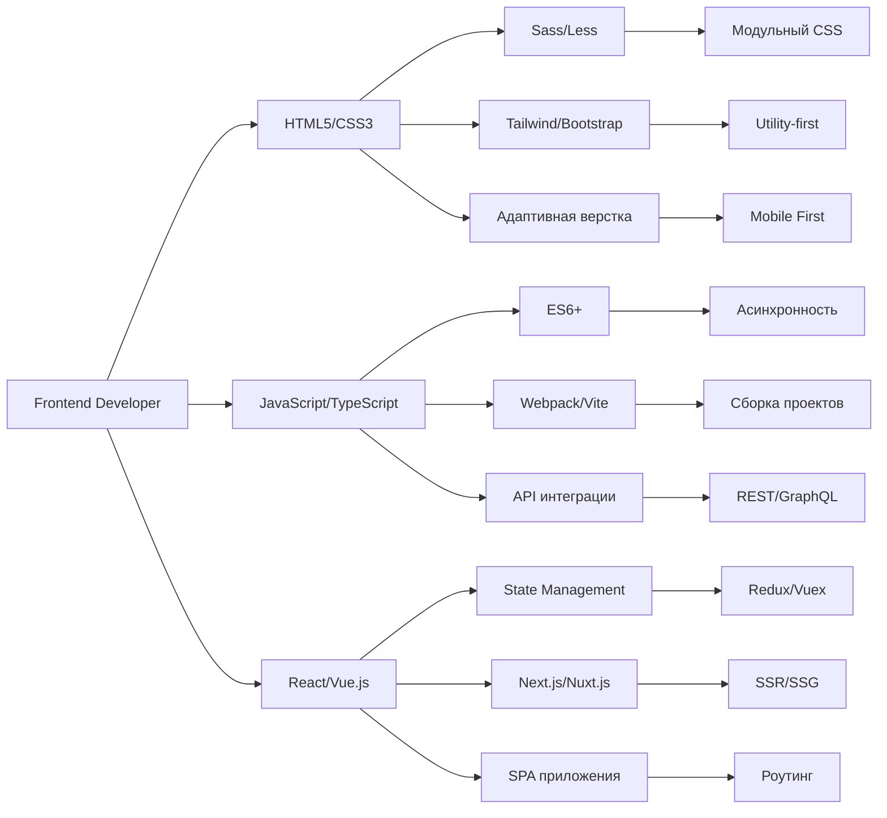

<p align="center">
  
  
  
  
</p>

<h1 align="center">
  
</h1>

<p align="center">
  <a href="https://skillicons.dev">
    
  </a>
</p>

<div align="center">

## 🎨 **Мои услуги**

</div>

<table>
<tr>
<td width="33%" align="center">

### 🎯 **Pixel Perfect**

**Цена:** от 10 000 ₽

✅ Точное соответствие макету
✅ Семантическая разметка
✅ Валидный код W3C
✅ Кроссбраузерность
⏱ Срок: 3-5 дней


```

</td>
<td width="33%" align="center">

📱 Адаптивный дизайн

https://media.giphy.com/media/l0MYt5jPR6QX5pnqM/giphy.gif
Цена:от 15 000 ₽

```yaml
✅ Mobile First подход
✅ Все разрешения
✅ Плавные breakpoints
✅ Тестирование на устройствах
⏱ Срок: 4-7 дней
```

</td>
<td width="33%" align="center">

⚡ Анимации

https://media.giphy.com/media/3o7abKhOpu0NwenH3O/giphy.gif
Цена:от 20 000 ₽

```yaml
✅ CSS/JS анимации
✅ Параллакс эффекты
✅ Микроинтеракции
✅ Плавные переходы
⏱ Срок: 5-10 дней
```

</td>
</tr>
</table>

<br>

<div align="center">
  
</div>

<br>

<div align="center">

💰 Прайс-лист

</div>

<table>
<tr>
<td width="25%" valign="top">

🟢 Базовый

```diff
+ Лендинг-пейдж
+ Адаптивная верстка
+ Формы обратной связи
+ Базовые анимации
+ Оптимизация скорости
- Сложные интеракции
- API интеграции
- Админ-панель
```

💵 от 10 000 ₽
⏱ 3-5 дней
🛡️ 30 дней гарантии

</td>
<td width="25%" valign="top">

🔵 Стандарт

```diff
+ Многостраничный сайт
+ Сложная навигация
+ Интерактивные элементы
+ Анимации GSAP
+ API интеграции
- Платежные системы
- Личный кабинет
- WebSocket
```

💵 от 25 000 ₽
⏱ 5-10 дней
🛡️ 60 дней гарантии

</td>
<td width="25%" valign="top">

🟣 Премиум

```diff
+ Интернет-магазин
+ Каталог товаров
+ Корзина покупок
+ Фильтры и сортировка
+ Платежные системы
+ Личный кабинет
- Сложная CRM
- PWA
```

💵 от 40 000 ₽
⏱ 10-15 дней
🛡️ 90 дней гарантии

</td>
<td width="25%" valign="top">

🟡 VIP

```diff
+ SPA приложение
+ React/Vue.js
+ JWT аутентификация
+ WebSocket чат
+ PWA возможности
+ Unit тесты
+ Админ-панель
+ Сложная CRM
```

💵 от 60 000 ₽
⏱ 15-25 дней
🛡️ 120 дней гарантии

</td>
</tr>
</table>

<br>

<div align="center">

📊 Сравнение тарифов

Особенность Базовый Стандарт Премиум VIP
Адаптивность ✅ ✅ ✅ ✅
Анимации 🟡 🟢 🔵 🟣
Формы 🟡 🟢 🔵 🟣
API ❌ 🟢 🔵 🟣
Платежи ❌ ❌ 🔵 🟣
PWA ❌ ❌ 🟡 🟣
Поддержка 30 дней 60 дней 90 дней 120 дней

</div>

<br>

<div align="center">
  
</div>

<br>

<div align="center">

🏆 Портфолио

</div>

<table>
<tr>
<td width="50%" align="center">

🏢 Корпоративный сайт

https://images.unsplash.com/photo-1460925895917-afdab827c52f?w=800&auto=format&fit=crop&q=60

```yaml
Клиент: IT компания
Технологии: React, TypeScript, Tailwind
Срок: 14 дней
Результат: +40% конверсии
Рейтинг: ⭐⭐⭐⭐⭐
```

</td>
<td width="50%" align="center">

🛒 Интернет-магазин

https://images.unsplash.com/photo-1556742049-0cfed4f6a45d?w-800&auto=format&fit=crop&q=60

```yaml
Клиент: Эко-маркет
Технологии: Vue.js, Vuex, SCSS
Срок: 18 дней
Результат: 500+ заказов/мес
Рейтинг: ⭐⭐⭐⭐⭐
```

</td>
</tr>
<tr>
<td width="50%" align="center">

🎨 Сайт-портфолио

https://images.unsplash.com/photo-1460925895917-afdab827c52f?w=800&auto=format&fit=crop&q=60

```yaml
Клиент: Дизайнер
Технологии: GSAP, CSS Grid
Срок: 7 дней
Результат: 3x заявок
Рейтинг: ⭐⭐⭐⭐⭐
```

</td>
<td width="50%" align="center">

📊 CRM система

https://images.unsplash.com/photo-1551288049-bebda4e38f71?w=800&auto=format&fit=crop&q=60

```yaml
Клиент: Логистика
Технологии: React, Redux, Node.js
Срок: 21 день
Результат: 80% автоматизация
Рейтинг: ⭐⭐⭐⭐⭐
```

</td>
</tr>
</table>

<br>

<div align="center">

📈 Моя статистика

</div>

<table>
<tr>
<td width="50%" align="center">

📊 Активность

https://github-readme-activity-graph.vercel.app/graph?username=YOUR_USERNAME&theme=react-dark&bg_color=0D1117&hide_border=true&area=true&custom_title=Моя%20активность&line=667EEA&point=4ECDC4

</td>
<td width="50%" align="center">

📈 Статистика GitHub

https://github-readme-stats.vercel.app/api?username=YOUR_USERNAME&show_icons=true&theme=radical&hide_border=true&bg_color=0D1117&include_all_commits=true&count_private=true
https://github-readme-stats.vercel.app/api/top-langs/?username=YOUR_USERNAME&layout=compact&theme=radical&hide_border=true&bg_color=0D1117

</td>
</tr>
</table>

<br>

<div align="center">

https://streak-stats.demolab.com?user=YOUR_USERNAME&theme=radical&border_radius=12&date_format=j%20M%5B%20Y%5D&background=0D1117

</div>

<br>

<div align="center">

🔧 Процесс работы

</div>

<table>
<tr>
<td width="25%" align="center">

1. 📞 Консультация

https://media.giphy.com/media/l1J9RFoDzCDrkqtEc/giphy.gif

```yaml
Время: 30-60 минут
Бесплатно: Да
Что обсуждаем:
  • Цели
  • Сроки
  • Бюджет
  • Тех. требования
```

</td>
<td width="25%" align="center">

2. 📝 ТЗ и макет

https://media.giphy.com/media/26n6WjS86Dctt1yIE/giphy.gif

```yaml
Этап: Подготовка
Срок: 1-2 дня
Что получаете:
  • Детальное ТЗ
  • Оценка
  • План работ
  • Сроки
```

</td>
<td width="25%" align="center">

3. 💻 Разработка

https://media.giphy.com/media/13HgwGsXF0aiGY/giphy.gif

```yaml
Этап: Реализация
Контроль: Daily reports
Что видите:
  • Демо на GitHub
  • Прогресс
  • Вопросы
  • Правки
```

</td>
<td width="25%" align="center">

4. 🚀 Запуск

https://media.giphy.com/media/l0MYt5jPR6QX5pnqM/giphy.gif

```yaml
Этап: Сдача
Что получаете:
  • Исходный код
  • Документация
  • Инструкции
  • Гарантия
```

</td>
</tr>
</table>

<br>

<div align="center">

📞 Контакты

</div>

<table>
<tr>
<td width="50%" align="center">

💬 Связаться со мной

https://img.shields.io/badge/Telegram-@frontend__dev-2CA5E0?style=for-the-badge&logo=telegram&logoColor=white
https://img.shields.io/badge/Email-hello%40frontend.dev-D14836?style=for-the-badge&logo=gmail&logoColor=white
https://img.shields.io/badge/WhatsApp-+7(999)123--45--67-25D366?style=for-the-badge&logo=whatsapp&logoColor=white

```yaml
Режим работы:
  Пн-Пт: 10:00 - 19:00
  Сб: По договоренности
  Вс: Выходной
Ответ в течение: 1-2 часов
```

</td>
<td width="50%" align="center">

📋 Быстрая заявка

```markdown
## Для быстрой оценки:
1. Тип сайта (лендинг, магазин и т.д.)
2. Количество страниц/экранов
3. Сроки (желаемые)
4. Бюджет (ориентировочно)
5. Макет (если есть)

Отправьте эти данные в Telegram!
```

https://img.shields.io/badge/💬_Написать_сейчас-667EEA?style=for-the-badge&logo=telegram&logoColor=white

</td>
</tr>
</table>

<br>

<div align="center">

🛠 Мои навыки

</div>



<br>

<div align="center">

❓ Частые вопросы

</div>

<details>
<summary><b>💳 Как происходит оплата?</b></summary>

Схема оплаты:

```diff
+ 30% — предоплата (начало работы)
+ 40% — после утверждения основной верстки
+ 30% — после сдачи проекта
```

Способы оплаты:

· Банковский перевод (Тинькофф, Сбер)
· ЮMoney (Яндекс.Деньги)
· PayPal (для иностранных клиентов)
· Криптовалюта (USDT, BTC)

Рассрочка: Возможна для проектов от 50 000 ₽

</details>

<details>
<summary><b>🛡️ Какая гарантия?</b></summary>

Гарантийные обязательства:

```yaml
Базовые тарифы:
  • Исправление багов: 30 дней
  • Консультации: 14 дней
  • Экстренная помощь: 7 дней

Премиум тарифы:
  • Исправление багов: 90 дней
  • Консультации: 30 дней
  • Экстренная помощь: 14 дней
  • Обновления: 2 бесплатных правки
```

Что входит в гарантию:

· Ошибки в моем коде
· Кроссбраузерные проблемы
· Адаптивные баги
· Оптимизационные вопросы

</details>

<details>
<summary><b>⚡ Можно ли сделать срочно?</b></summary>

Срочные заказы:

```diff
+ 1-2 дня: +50% к стоимости
+ 3-4 дня: +30% к стоимости
+ 5-7 дней: +20% к стоимости
+ 8-10 дней: +10% к стоимости
```

Что ускоряет работу:

· Полный и детальный макет
· Утвержденное ТЗ
· Быстрые ответы на вопросы
· Оплата по этапам без задержек

Ночи и выходные: +100% к ставке

</details>

<details>
<summary><b>🌍 Работаете с иностранными клиентами?</b></summary>

Международные проекты:

```yaml
Принимаю заказы из:
  • США/Канада: 🌎
  • Европа: 🇪🇺
  • Азия: 🇨🇳
  • СНГ: 🇷🇺

Языки общения:
  • Русский: Родной
  • Английский: B2 (Upper Intermediate)
  • Украинский: A2 (Basic)

Оплата:
  • PayPal: Preferred
  • Wise: 2-3% комиссия
  • Crypto: USDT, BTC
  • Bank Transfer: SWIFT
```

</details>

<br>

<div align="center">

🚀 Готовы начать проект?

Напишите мне прямо сейчас и получите бесплатную консультацию!

https://img.shields.io/badge/💬_Обсудить_проект-667EEA?style=for-the-badge&logo=telegram&logoColor=white&labelColor=0D1117
https://img.shields.io/badge/📧_Отправить_запрос-FF6B6B?style=for-the-badge&logo=gmail&logoColor=white&labelColor=0D1117

---

✨ Почему выбирают меня:

```diff
+ 100% выполнение сроков
+ Прозрачное ценообразование
+ Ежедневные отчеты
+ Качественный код
+ Пожизненная консультация
```

⭐ Если понравилось портфолио — оставьте звезду на GitHub!

</div>

https://capsule-render.vercel.app/api?type=waving&color=gradient&height=100&section=footer&reversal=true

```
